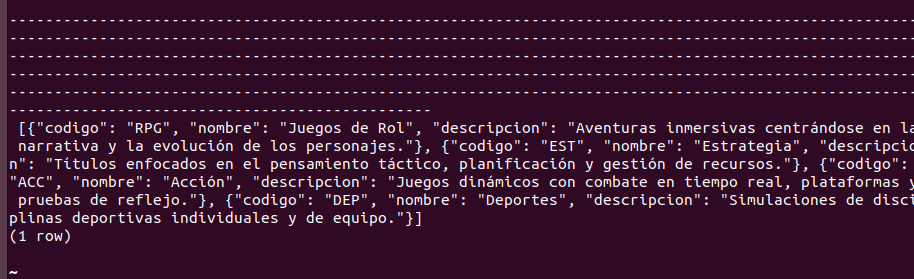
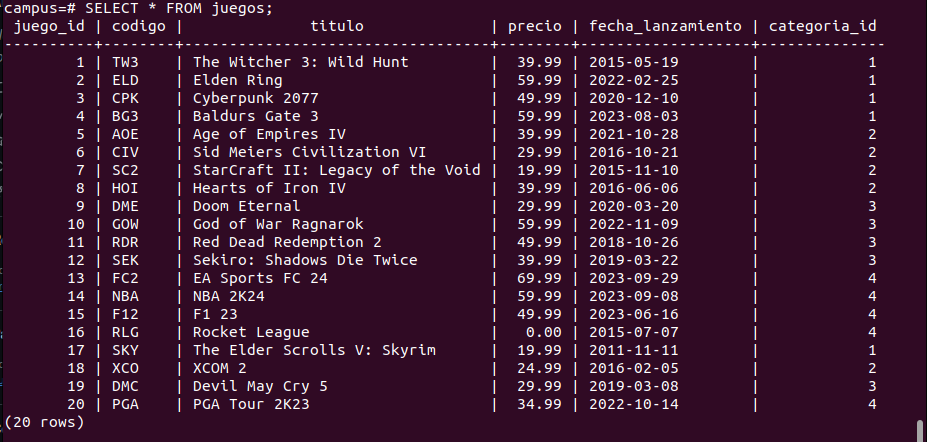
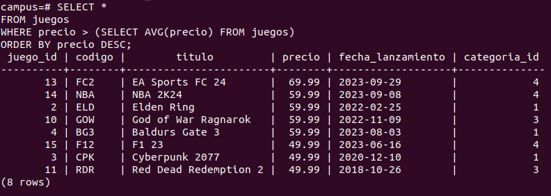
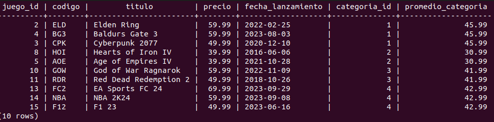
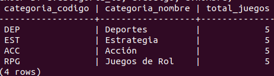

## 
CREATE TABLE categorias (
    categoria_id SERIAL PRIMARY KEY,
    codigo CHAR(3) NOT NULL UNIQUE,
    nombre VARCHAR(100) NOT NULL,
    descripcion VARCHAR(250)
);
CREATE TABLE
campus=# CREATE TABLE juegos (
    juego_id SERIAL PRIMARY KEY,
    codigo CHAR(3) NOT NULL UNIQUE,
    titulo VARCHAR(150) NOT NULL,
    precio NUMERIC(8, 2) NOT NULL,
    fecha_lanzamiento DATE,
    categoria_id INT NOT NULL
);

## insercion de datos.xml

#### comandos utilizados
## 
CREATE TABLE temporal_json(data JSONB);

##
\COPY temporal_json(data) FROM PROGRAM 'tr -d "\r\n" < /home/camper/postgresdata/categorias.json';

## 
INSERT INTO categorias(codigo, nombre, descripcion)
SELECT 
     e->> 'codigo',
     e->>'nombre',
     e->>'descripcion'
FROM temporal_json AS t 
CROSS JOIN LATERAL  jsonb_array_elements(t.data) AS e;

##
SELECT * FROM temporal_json;

## insercion de datos.xml

#### comandos utilizados
CREATE TEMP TABLE temporal_xml(data XML);

\COPY temporal_xml(data) FROM PROGRAM 'tr -d "\r\n" < /home/camper/postgresdata/juegos.xml';

INSERT INTO juegos (codigo, titulo, precio, fecha_lanzamiento, categoria_id)
SELECT
   unnest(xpath('/juegos/juego/codigo/text()', data::XML))::TEXT AS codigo,
   unnest(xpath('/juegos/juego/titulo/text()', data::XML))::TEXT AS titulo,
   unnest(xpath('/juegos/juego/precio/text()', data::XML))::TEXT::NUMERIC AS precio,
   unnest(xpath('/juegos/juego/fecha_lanzamiento/text()', data::XML))::TEXT::DATE AS fecha_lanzamiento,
   unnest(xpath('/juegos/juego/categoria_id/text()', data::XML))::TEXT::INT AS categoria_id
FROM temporal_xml;

SELECT * FROM juegos;

## obten los 8 juegos sobre el promedio global y los 10 sobre su categoria 

###### consulta 1

###### consulta 2

## auditoria: cuenta juegos por categoria con LEFT JOIN el resultado es 5 en cada una

